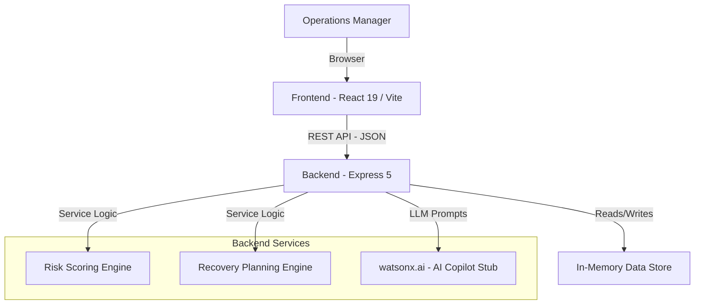

# Architecture

## System Architecture

The SupplyShield AI platform follows a modern, decoupled client-server architecture.

## Components

| Component | Technology | Responsibility |
|---|---|---|
| Frontend | React 19, Vite, Tailwind CSS 4 | Dashboard UI, data visualization (Recharts), and interactive recovery planning |
| Backend API | Node.js, Express 5 | Business logic, API routing, orchestration |
| AI / Copilot | watsonx.ai (Stubbed) | Natural language interface for querying supply chain data and generating insights |
| Database | In-Memory Object Store | Storing relational data (users, shipments, disruptions, fleet, routes) for the prototype |
| Risk Engine | Custom Node.js Logic | Real-time calculation of shipment risk based on active disruptions and delivery SLAs |

## Data Flow

1. **Ingestion:** The system loads seeded disruption, route, fleet, and shipment data into the in-memory store upon server start.
2. **Analysis:** The `Risk Scoring Engine` continuously evaluates active shipments against active disruptions on their assigned routes. It factors in cold-chain temperature logs and delivery deadlines to generate a dynamic Risk Score (1-100).
3. **Presentation:** The React frontend polls the `/api/dashboard/summary` and other endpoints to render real-time KPIs, maps, and lists.
4. **Recovery Generation:** When a user requests a recovery plan, the backend analyzes alternative routes and available fleet, simulates the impact (expected delay reduction), and presents the plan to the user.
5. **Copilot Interaction:** User queries in the Copilot UI are sent to the backend, parsed (currently via keyword matching fallback), and answered with specific data insights from the store.

## Security Considerations

- API routes are protected by JWT authentication (implemented via `authController`).
- The JWT Secret and external API keys are configured via `.env` variables and never committed to version control.
- CORS is configured to only allow requests from the designated frontend URL.

## Scalability Notes

For a production deployment, the architecture would evolve as follows:
- The in-memory store would be replaced by a robust NoSQL database (e.g., MongoDB, utilizing the existing Mongoose schemas).
- The Express backend is stateless (aside from the DB connection) and can be horizontally scaled behind a load balancer.
- The AI Copilot stub would be replaced with actual API calls to IBM watsonx.ai, potentially utilizing a caching layer (Redis) to reduce inference latency and cost for common queries.

## IBM Technology Integration

### 1. IBM Bob (AI SDLC Partner)
IBM Bob was deeply integrated into our software engineering lifecycle to build and validate this project:
- **Plan Mode:** Architected the normalized data schema linking disruptions, routes, shipments, and telematics logs.
- **Agent Mode:** Accelerated backend API implementation (Express 5 controllers) and developed reactive React 19 UI widgets.
- **Automated Verification:** Verified zero-dependency local execution, executed linting checks, and eliminated configuration bottlenecks.

### 2. IBM watsonx.ai
- **Model:** IBM watsonx.ai Granite 3.0 foundation model pipeline design for conversational root-cause analysis and operational summarization.
- **Prompt Engineering:** Structured context windows combining active shipment manifests, disruption metadata, and sensor feeds.
- **Offline Fallback Provider:** A built-in resilient fallback pattern ensures full evaluation reproducibility even when external IBM cloud credentials are not loaded.
